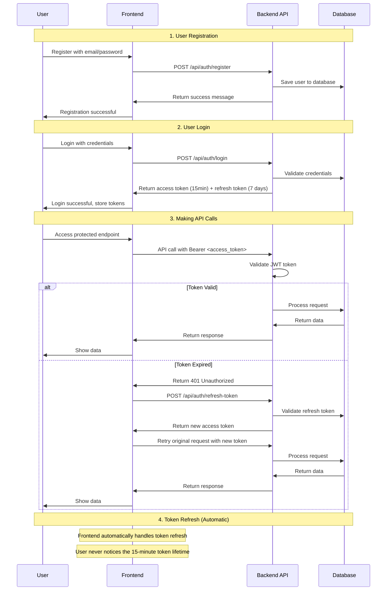

# 🚗 Rentaly - Car Rental Application

A full-stack car rental application built with Spring Boot backend and React frontend, featuring user authentication, car management, booking system, and monitoring capabilities.

## ✨ Features

### 🚀 Core Functionality
- **User Authentication & Authorization** - JWT-based authentication with role-based access control
- **Car Management** - Admin can add, edit, and manage rental cars
- **Booking System** - Users can rent cars and view their bookings
- **Invoice Generation** - Automatic invoice creation for rentals
- **File Upload** - Support for car images and documents
- **Real-time Monitoring** - Prometheus metrics and Grafana dashboards

### 🔧 Technical Features
- **RESTful API** - Well-structured REST endpoints with Swagger documentation
- **Database Migrations** - Flyway for version-controlled database schema
- **Docker Support** - Containerized deployment with Docker Compose
- **Monitoring Stack** - Prometheus, Grafana, and PostgreSQL monitoring
- **Security** - Spring Security with JWT authentication

## 🏗️ Architecture

```
rentaly/
├── rental-app/          # Spring Boot Backend (Java 17)
│   ├── src/main/java/  # Java source code
│   ├── src/main/resources/  # Configuration & migrations
│   └── docker-compose.yml   # Docker services
└── frontend/            # React Frontend (TypeScript + Vite)
    ├── src/             # React components & pages
    ├── src/components/  # Reusable UI components
    └── src/pages/       # Application pages
```

## 🛠️ Tech Stack

### Backend
- **Java 17** with **Spring Boot 3.5.4**
- **Spring Security** with JWT authentication
- **Spring Data JPA** with **PostgreSQL**
- **Flyway** for database migrations
- **MapStruct** for object mapping
- **Lombok** for boilerplate reduction

### Frontend
- **React 19** with **TypeScript**
- **Vite** for fast development and building
- **Tailwind CSS** for styling
- **React Router** for navigation
- **Axios** for API communication

### Infrastructure
- **Docker** & **Docker Compose**
- **PostgreSQL 16** database
- **Prometheus** for metrics collection
- **Grafana** for visualization
- **Node Exporter** for system metrics

## 🚀 Quick Start

### Prerequisites
- **Java 17** or higher
- **Node.js 18** or higher
- **Docker** and **Docker Compose**
- **Maven** (for backend development)
- **Git**

### Option 1: Docker (Recommended for Production)

1. **Clone the repository**
   ```bash
   git clone <repository-url>
   cd rentaly
   ```

2. **Start all services**
   ```bash
   cd rental-app
   docker-compose up -d
   ```

3. **Access the application**
   - **Backend API**: http://localhost:8080
   - **Frontend**: http://localhost:3000 (if running frontend)
   - **Swagger Docs**: http://localhost:8080/swagger-ui.html
   - **Grafana**: http://localhost:9090 (admin/admin)
   - **Prometheus**: http://localhost:9090

### Option 2: Local Development

#### Backend Setup

1. **Navigate to backend directory**
   ```bash
   cd rental-app
   ```

2. **Start PostgreSQL database**
   ```bash
   # Using Docker for database only
   docker-compose up -d db
   
   # Or use local PostgreSQL with these credentials:
   # Database: rentaly_db
   # Username: postgres
   # Password: postgres
   # Port: 5432
   ```

3. **Run the Spring Boot application**
   ```bash
   # Using Maven wrapper
   ./mvnw spring-boot:run
   
   # Or using Maven
   mvn spring-boot:run
   ```

#### Frontend Setup

1. **Navigate to frontend directory**
   ```bash
   cd frontend
   ```

2. **Install dependencies**
   ```bash
   npm install
   ```

3. **Start development server**
   ```bash
   npm run dev
   ```

4. **Access the frontend**
   - **Development**: http://localhost:5173
   - **Production build**: `npm run build`

## 📚 API Documentation

### Swagger UI
Access the interactive API documentation at: http://localhost:8080/swagger-ui.html

### Key Endpoints
- **Authentication**: `/api/auth/**`
- **Cars**: `/api/cars/**`
- **Bookings**: `/api/bookings/**`
- **Users**: `/api/users/**`
- **File Upload**: `/api/upload/**`

## 🗄️ Database

### Schema Management
Database migrations are handled by Flyway and located in:
```
rental-app/src/main/resources/db/migration/
```

### Key Tables
- `users` - User accounts and authentication
- `cars` - Available rental cars
- `bookings` - Car rental bookings
- `invoices` - Generated invoices
- `car_images` - Car photos and documents
- `refresh_tokens` - JWT refresh tokens

## 🔐 Authentication

The application uses JWT (JSON Web Tokens) for authentication with a secure access token + refresh token pattern:

### 🔄 Authentication Flow



### 🔑 Token Strategy

- **Access Token**: 15 minutes lifetime for security
- **Refresh Token**: 7 days lifetime for user convenience
- **Auto-refresh**: Seamless token renewal without user intervention

### 📍 Authentication Endpoints

1. **Register** at `/api/auth/register`
2. **Login** at `/api/auth/login` to receive access and refresh tokens
3. **Refresh** at `/api/auth/refresh-token` to get new access token
4. **Use access token** in Authorization header: `Bearer <token>`

### 👥 User Roles
- **USER**: Can browse cars, make bookings, view invoices
- **ADMIN**: Can manage cars, view all bookings, access admin dashboard

## 📊 Monitoring & Observability

### Prometheus Metrics
- Application metrics at `/actuator/prometheus`
- Database metrics via PostgreSQL exporter
- System metrics via Node exporter

### Grafana Dashboards
- **PostgreSQL Dashboard**: Database performance metrics
- **Application Dashboard**: Business metrics and KPIs

### Access Monitoring
- **Grafana**: http://localhost:9090 (admin/admin)
- **Prometheus**: http://localhost:9090

## 🧪 Testing

### Backend Tests
```bash
cd rental-app
./mvnw test
```

### Frontend Tests
```bash
cd frontend
npm run test
```

## 🐳 Docker Commands

### Useful Docker Commands
```bash
# Start all services
docker-compose up -d

# View logs
docker-compose logs -f

# Stop all services
docker-compose down

# Rebuild and restart
docker-compose up -d --build

# View running containers
docker-compose ps

# Access database
docker-compose exec db psql -U postgres -d rentaly_db
```

## 📋 Development Checklist

### ✅ Completed
- [x] Database schema and migrations
- [x] User authentication and authorization
- [x] Docker containerization
- [x] Prometheus & Grafana monitoring
- [x] File upload functionality
- [x] Swagger API documentation
- [x] Basic CRUD operations for cars and users
- [x] Booking system foundation

### 🚧 In Progress
- [ ] Comprehensive testing coverage
- [ ] Email notification system
- [ ] Payment integration
- [ ] Redis caching implementation

## 🐛 Troubleshooting

### Common Issues

1. **Port conflicts**
   - Ensure ports 8080, 5432, 9090, 3000 are available
   - Check for other running services

2. **Database connection issues**
   - Verify PostgreSQL is running: `docker-compose ps db`
   - Check database logs: `docker-compose logs db`

3. **Frontend build issues**
   - Clear node_modules: `rm -rf node_modules && npm install`
   - Check Node.js version: `node --version`

4. **Backend startup issues**
   - Verify Java version: `java --version`
   - Check application logs: `docker-compose logs backend`

## 🤝 Contributing

1. Fork the repository
2. Create a feature branch: `git checkout -b feature-name`
3. Commit changes: `git commit -m 'Add feature'`
4. Push to branch: `git push origin feature-name`
5. Submit a pull request

## 📄 License

This project is licensed under the MIT License.

## 📞 Support

For questions or issues:
- Create an issue in the repository
- Check the troubleshooting section above
- Review the Swagger API documentation

---

**Happy coding! 🚀**